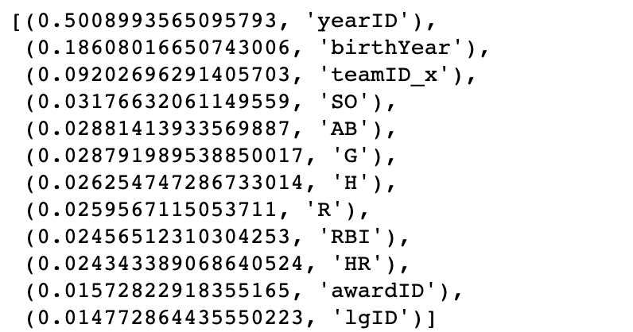

## How does it work?
This model worked by first understanding our decision tree. The initial process identified the question we wanted to answer by looking at the overall data. After reviewing, we narrowed it down to four dataframes and merged two at a time. This way it was easier to decide which columns to keep and drop as well as drop any null values. It was important to clean the data and drop columns that werent needed from those merged dataframes and then combined the dataframes into one main dataframe of baseball stats. While pre-processing the data, we chose supervised learning via a Random Foreast Model to get our desired answer of building a baseball team and what we should have as our base information when a team chose a player. The Random Forest Model used classification to predict based on our salary target and our features which were year, team, stats (like strike outs), and birth year. By pairing down the data, through combining and cleaning the csv files, it really dialed in to the details of what we wanted to measure. Basing the main measures on Mike Trout's core statistics, because he was argued the best player in baseball for the past few years (SO,AB,R,H,HR,G,R and RBIs). His metrics were used as a baseline to look for when deciding our final goal. Also, including the awardID, which shows which award each player won, and lgID, which showed the league in to see if that had any impact. Then, we split the data into training and testing sets so that way we have a method to train the machine learning model. The training set helps train the model to get used to the statistical baseball data we want it to work on than we incorporate the test set to see how it actually performs given if we add new data for it to predict. Scaling the data helps us to normalize the distance between data and account for any extreme values that might throw off the model’s predictions. Then the random forest model interprets this information and gives an accuracy score based on what is the most impactful in deciding the salary of a player. The confusion matrix and list of importances each show the logic behind what determines how much to pay each player. Those benefits display the final statistical information which showed off in a weighted format and really gave clarifty as to what is the most valuable when choosing a slary for a player. A couple limitations would be pre-processing has to be specifically tabular data and the repetition of the data we chose. Players who performed in multiple years, could have increased the accuracy of the data. Upon discussion, removing the multiple years and only have one year would not really yield the data for anything other than salary because those individual stats and team stats.

## Why this specific model?
We wanted to use this supervised learning because we wanted to see the weighted importances that go into building a team based on salary. The salary was really the base in showing how much a player is worth based on factors like stats, year they were born, and year they played baseball.

## What is the model's accuracy?
Our original goal was to have a models accuracy at 80% or higher. We did accomplish that with 99% accuracy. There are some duplications just because there are some players who performed in multiple years, which can increase the accuracy of the data. Upon discussion, removing the multiple years and only have one year would not really give the data for anything other than salary because those individual stats and team stats.

## If there are statistics involved, what stats are being included in analysis and why?
The statistics inlcuded were the average salary of players based on the players csv file. The average salary for all of the players for all of the years was $2,085,634. We also wanted to have only players who were active in the league currently. By narrowing down the birthyear to to last 40 years will pretty much include only those active players. The importances also show the statistical results of what the machine learning model weights for levels of how it came to the accuracy percentage. The importances also list all the statistics used and more easily visualizes the details listed above like strike outs, at bats, games, home runs, etc. 

## If no statistics are involved, what would you include if you had more time?
There were statistics involved. 

