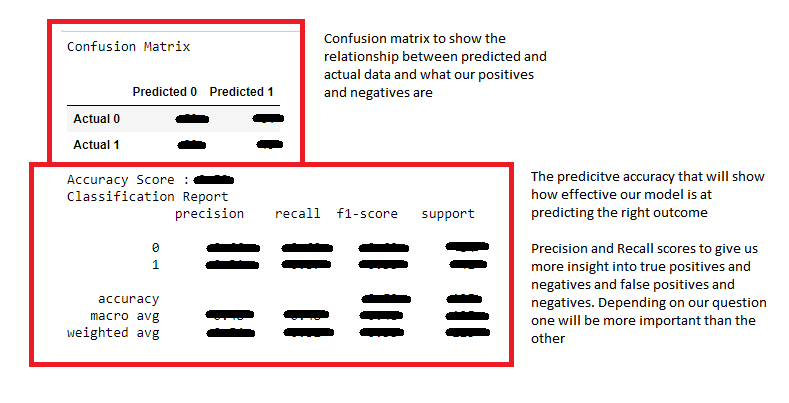
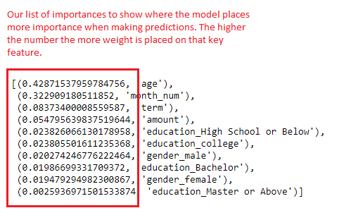

# Triangle Role

## Mock Model

1. Choose our dataset
2. Clean the data set and preprocess for Machine Learning
3. Split data into training and testing data
4. Scale the data
5. Fitting the data to the model we choose
6. Retrieve the results (confusion matrix, accuracy, feature importances) 
7. Optimize the model if necessary (adjusting the n_estimators, dropping more features, etc.)

*Which model did you choose and why?*

The Random Forest Supervised Learning model. This model allows us to predict binary outcomes based on our dataset as well as showcasing what features the machine places more weight towards when it makes its predictions. We'll be using a large dataset so Random Forest will excel here.

*How are you training your model?*

We will be training our model based on data from 2020 Baseball statistics. We will split the data into training and testing datasets

*What is the model's accuracy?*

80% would be fair start for where we want our machine learning model to be when predicting our outcome. 

*How does this model work?*

Takes in several columns that we declare as our features to predict the column we declare as our target column. Random Forest will use several decision trees to strengthen the overall accuracy of the model when predicting our outcome. Depending on the amount of n_estimators we add, the accuracy of our model should improve. The model will generate several statistics such as our confusion matrix, accuracy scores and importances so that we have an idea of how effective the model will be at predicting new data.

