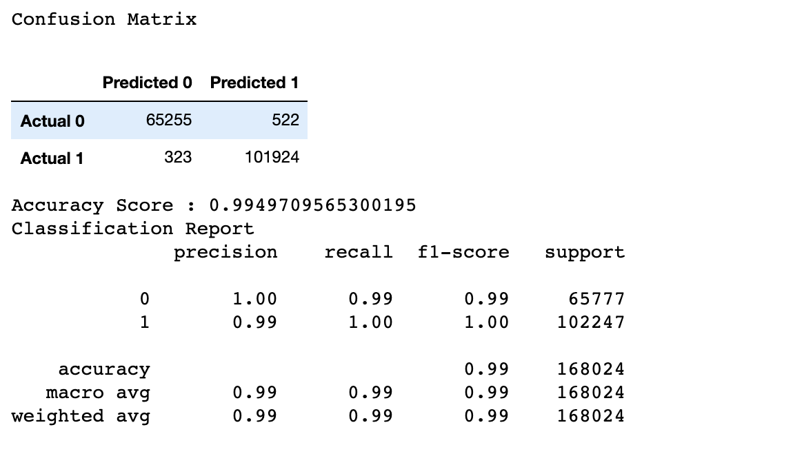

## How does it work?
This model works by first understanding our decision tree. Through pre-processing the data, we chose supervised learning via a Random Foreast Model to get our desired answer of building a baseball team and what we should have as our base information when in choosing a player. The Random Forest Model uses classification to predict based on our salary target and our features which are year, team, stats (like strike outs), and birth year. Then the random forest model interprets this information and gives an accuracy score based on what is the most impactful in deciding the salary of a player. The confusion matrix and list of importances each show the logic behind what determines how much to pay each player. 

## Why this specific model?
We wanted to use this supervised learning because we wanted to see the weighted importances that go into building a team based on salary. The salary was really the base in showing how much a player is worth based on factors like stats, year they were born, and year they played baseball.

## What is the model's accuracy?
Our original goal was to have a models accuracy at 80% or higher. We did accomplish that with 99% accuracy. There are some duplications just because there are some players who performed in multiple years, which can increase the accuracy of the data. Upon discussion, removing the multiple years and only have one year would not really give the data for anything other than salary because those individual stats and team stats.

## If there are statistics involved, what stats are being included in analysis and why?
The statistics inlcuded were the average salary of players based on the players csv file. The average salary for all of the players for all of the years was $2,085,634. We also wanted to have only players who were active in the league currently. By narrowing down the birthyear to to last 40 years will pretty much include only those active players. The importances also show the statistical results of what the machine learning model weights for levels of how it came to the accuracy percentage. The importances also list all the statistics used and more easily visualizes the details listed above like strike outs, at bats, games, home runs, etc. 

## If no statistics are involved, what would you include if you had more time?
There were statistics involved. 

