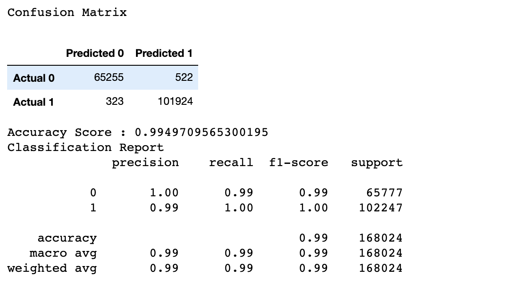

# Baseball Statistics - Beyond the Batter's Box

## Overview:
We will be analyzing a wide variety of data focused on Major League Baseball teams.  The goal will be to create a machine learning model, functional database, and compelling presentation that can answer a large range of questions.  

## Project Outline:
### Database Outline
We decided to use Postgres for our data storage because of its ease of use and our familiarity with it. HOWEVER, our choice to use Postgres would leave us two choices either subscribe to a Web hosting service like AWS and possibly incurring some cost or develop a solution to allow the team to access the same data, same format and same schema Postgres Database for our machine learning model.

The Steps below outline the how we were able to setup replica Postgres Databases on each team member’s device and make a connection, so our machine learning models were able to access the data.

First, we identified the csv files we would like to use for our analysis. Second, imported the relevant csv files into our notebook as a data frame using pandas so we could review the data. Third, step was to clean the data of irrelevant data columns that were of no use. Fourth create the connection to our Postgres database instance using sqlAlchemy so we can import the data into tables. Fifth, step we imported our partially cleaned data frames into our Postgres Database. Last step we confirm the data imported correctly by using the pd.read_sql_table pandas command. If the import was successful, this will display the designated table in our jupyter notebook as a data frame.

### Machine Learning Model Outline
We wanted to use this supervised learning because we wanted to see the weighted importances that go into building a team based on salary. The salary was really the base in showing how much a player is worth based on factors like stats, year they were born, and year they played baseball.

The initial process identified the question we wanted to answer by looking at the overall data. After reviewing, we narrowed it down to four dataframes and merged two at a time. This way it was easier to decide which columns to keep and drop as well as drop any null values. It was important to clean the data and drop columns that werent needed from those merged dataframes and then combined the dataframes into one main dataframe of baseball stats. While pre-processing the data, we chose supervised learning via a Random Foreast Model to get our desired answer of building a baseball team and what we should have as our base information when a team chose a player. The Random Forest Model used classification to predict based on our salary target and our features which were year, team, stats (like strike outs), and birth year. By pairing down the data, through combining and cleaning the csv files, it really dialed in to the details of what we wanted to measure. Also, including the awardID, which shows which award each player won, and lgID, which showed the league in to see if that had any impact. Then, we split the data into training and testing sets so that way we have a method to train the machine learning model. The training set helps train the model to get used to the statistical baseball data we want it to work on than we incorporate the test set to see how it actually performs given if we add new data for it to predict. Scaling the data helps us to normalize the distance between data and account for any extreme values that might throw off the model’s predictions. Then the random forest model interprets this information and gives an accuracy score based on what is the most impactful in deciding the salary of a player. The confusion matrix and list of importances each show the logic behind what determines how much to pay each player. 

### Dashboard Outline

The dashboard was created in Tableau. It highlights salary comparisons, general baseball statistics, and a complete story which really displays and puts an more of a connection between the machine learning model and what it accomplished with the data. Utilizing the baseball statistics in more detail and expounding on the information in the datasource, gives more life to the overall project. 

## Google Slides Outline
This draft presentation puts the whole project together in a cohesive story from a list of csv files, to a machine learning model, to an illustrated story in Tableau, to the summary and overview of the presentation itself. When we chose baseball statistics there was a thought process that it would be able to tell an exciting story of if you were to chose your own baseball team and how much should you pay them. 
________________________________
## Dashboard:
You can connect to our complete story in the Tableau Public dashboard [here](https://public.tableau.com/profile/frank2753#!/vizhome/CompleteBaseballTableauStory/Complete_Story?publish=yes)

Links to each Dashboard will be below:

1. General Baseball Dashboard

https://public.tableau.com/profile/frank2753#!/vizhome/General_Baseball_Stats/General_Baseball_Stats?publish=yes

2. Baseball Salary Comparisons 1

https://public.tableau.com/profile/frank2753#!/vizhome/SalaryComparisons1/Salary_Baseball_Relationships?publish=yes

3. Baseball Salary Comparisons 2

https://public.tableau.com/profile/frank2753#!/vizhome/SalaryComparisons2/Salary_Baseball_Relationships2?publish=yes

4. Baseball Salary Comparisons 3

https://public.tableau.com/profile/frank2753#!/vizhome/SalaryComparisons3/Salary_Baseball_Relationships3?publish=yes

5. MLM Dashboard

https://public.tableau.com/profile/frank2753#!/vizhome/MachineLearningModelResults/mlm_results?publish=yes

## Data Source
Lahman Database http://www.seanlahman.com/baseball-archive/statistics/

## Technology
Please read a breakdown of the different technology we are using to complete the project [here](https://github.com/davidfashbinder/final_project/blob/master/Resources/technology.md)

## Database
Please follow [these](https://github.com/davidfashbinder/final_project/blob/master/DB%20Instructions.md) instructions to load the database using pgAdmin.

You can view a copy of our ERD to get a better understanding of the relationships between tables [here](https://github.com/davidfashbinder/final_project/blob/master/Updated_ERD.png)

## Machine Learning Model 
Please read a detailed breakdown of our machine learning model [here](https://github.com/davidfashbinder/final_project/blob/master/Machine%20Learning%20Info.md)

## Google Slides

-----

## Team Members:
1. Frank Berni (fcberni)
2. David Fashbinder (davidfashbinder)
3. Austin Keeler (austink24)
4. Christa Maraffi (cmaraffi)

## Roles for Deliverable One:
1. Square - David Fashbinder
2. Circle - Austin Keeler
3. Triangle - Frank Berni
4. X - Christa Maraffi

## Roles for Deliverable Two:
1. Square - Christa Maraffi
2. Circle - Frank Berni
3. Triangle - Austin Keeler
4. X - David Fashbinder

## Roles for Deliverable Three:
1. Square - Christa Maraffi
2. Circle - Frank Berni
3. Triangle - David Fashbinder
4. X - Austin Keeler
